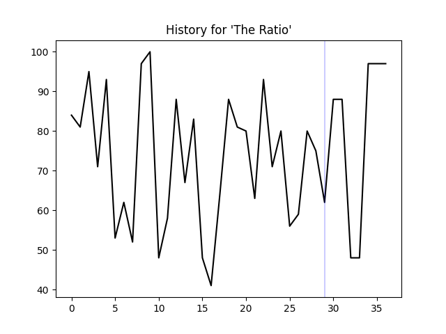

.. _api:

API Reference
=============
Documentation for the Python functions and classes that power memewizard.
Whatever functions that do not have comments are not documented.

memewizard.__init__
-------------------
The general functions which almost all relate to data

*****
meme_object
*****
The meme_object class to handle KnowYourMeme data.

.. code-block:: python

    import memewizard
    obj = memewizard.meme_object

=====
fetch_memes()
=====
Scrape any memes page on knowyourmemes.com

.. code-block:: python

    def fetch_memes(page: str) -> list:

**Usage**

.. code-block:: python

    # scrape first page
    obj.fetch_memes('1')
    '''
    ["You're Telling Me a Shrimp Fried This Rice?", 
    'CalArts', 
    'Bad Sasuke Drawing', 
    'Quirked Up White Boy Goated With The Sauce', 
    'Yankee With No Brim', 
    'Mr. Incredible Becoming Uncanny', 
    '50 DKP Minus / Onyxia Wipe', 
    'Ike Quotes', ':3 / Cat Face', 
    'Winrar', 
    'Tobey Maguire Face', 
    'Let Me Show You My Pokemans']
    '''

=====
fetch_meme_info()
=====
Fetch more information on a meme with a given URL.

.. code-block:: python

    def fetch_meme_info(url: str) -> dict:

**Usage**

.. code-block:: python

    # scrape info about Peepo
    obj.fetch_meme_info('https://knowyourmeme.com/memes/peepo')
    '''
    {'Peepo': 
    [['Name', 'Peepo'], 
    ['Status', 'confirmed'], 
    ['Origin', 'Twitch'], 
    ['Year', '2017'], 
    ['Type', 'Emoticon']]}
    '''
=====
fetch_meme_images()
=====
Find relevant images for a list of memes.
(This isn't used at all in memewizard, by the way.)

.. code-block:: python

    def fetch_meme_images(meme_list: list) -> list:

**Usage**

.. code-block:: python

    # fetch images for every meme on the first page of knowyourmemes
    obj.fetch_meme_images(obj.fetch_memes('1'))
    '''
    ['https://encrypted-tbn0.gstatic.com/images?q=tbn:ANd9GcTxHmSUFBO-c13yTQokiQ_y0EeuwnyVrYMdqRUihyMX2u7uzwFldL02ujfZuhs:https://i.ytimg.com/vi/u6P5d9gWXZM/maxresdefault.jpg&s', 
    'https://encrypted-tbn0.gstatic.com/images?q=tbn:ANd9GcRcVxrz0Wl9BTpkm6LSjG0ZFmAq8_7XrGl2L4CMg1xDFw_kBqWkH2iT-bre3X8:https://www.cartoonbrew.com/wp-content/uploads/2019/03/calartsprotest.jpg&s', 
    'https://encrypted-tbn0.gstatic.com/images?q=tbn:ANd9GcRM-xj_pVvF-KKWIPzf1QT286CdqymsyN6VLFajR6Pz1BtlToYnzSDVOTNOPyI:https://i.pinimg.com/originals/7d/f0/d2/7df0d2cc01efd64a652203531df92f26.jpg&s', 
    'https://encrypted-tbn0.gstatic.com/images?q=tbn:ANd9GcSB9SEV9Kcszu1_1fxGGBIXpu0nNgUy2x38t9Y4nw8j4Ntw4LGp2SyeIMB5EJA:https://img.ifunny.co/images/a2ee64c90700f93bc4a0f6dbfd90d4d8dd8ab81fbe09de11251eea2849229150_1.jpg&s', 
    'https://encrypted-tbn0.gstatic.com/images?q=tbn:ANd9GcQoYKZsx-qZxTo4EUJDFSvw6-7Y_WzvXXo4e96pM9Z5z92OZChHMlokISKrwNU:https://images.complex.com/images/fl_lossy,q_auto,w_910,dpr_auto/ysvsw4qv6mjhsa8tidf8/new-era-yankees-hat&s', 
    'https://encrypted-tbn0.gstatic.com/images?q=tbn:ANd9GcSsZ1F4h7OKdD3YKkcdtvBmY-iv_3cLCkUtR4vfhufe_iMDH9Qwg08-v0nOhg:https://i.ytimg.com/vi/45aQi9vsaBM/hqdefault.jpg&s', 
    'https://encrypted-tbn0.gstatic.com/images?q=tbn:ANd9GcRPtMDjLBoCmndpodlh-sXkitaA1fXSPreNXmWrsN-KlSm1TUEBKEJvErMZlvM:https://pics.me.me/thumb_comment-section-on-every-nsfw-post-gif-on-imgur-54242997.png&s', 
    'https://encrypted-tbn0.gstatic.com/images?q=tbn:ANd9GcTwhV-7tpbfgfymNCrLCJ9FuRzNHzp3cJj6B27OaIuPcqL7Ze8MLjIa4hcqBqk:https://www.usnews.com/dims4/USNEWS/28fb2e4/2147483647/resize/300x%253E/quality/85/%3Furl%3Dhttps%253A%252F%252Fwww.usnews.com%252Fdbimages%252Fmaster%252F23484%252FHP_110930_Ike_Poster.jpg&s', 
    'https://encrypted-tbn0.gstatic.com/images?q=tbn:ANd9GcT2JwmP-N2OZ92IVs4O6zLp5FfewrJ_KO-iMEucvvRZ8bS86DMJBibLvK8H:https://static.wixstatic.com/media/8fc2cb_063b56b82fae42b28cbe1ee0ccc8e0da~mv2.png/v1/fill/w_5000,h_3921,al_c,usm_0.66_1.00_0.01/8fc2cb_063b56b82fae42b28cbe1ee0ccc8e0da~mv2.png&s', 
    'https://encrypted-tbn0.gstatic.com/images?q=tbn:ANd9GcRhrWGKLBPOLmgvMmUXZKpU6xCMRjwEvlX7ilyMG7gBoHsUu6rYVhoUQLNBeg:https://images.sftcdn.net/images/t_app-cover-m,f_auto/p/b3562592-96bf-11e6-ba7b-00163ec9f5fa/2138966026/winrar-WinRar%25201.png&s', 
    'https://encrypted-tbn0.gstatic.com/images?q=tbn:ANd9GcQ4PC07u_CztpILMGtngawDScVFZURGxNA6uShMwwDIkX3xGC1JQdSM_skeGQY:https://s.yimg.com/uu/api/res/1.2/dBkcufjWEf1ZLHDw6maxdw--~B/aD02NTA7dz0xMjAwO2FwcGlkPXl0YWNoeW9u/https://media.zenfs.com/en-US/fatherly_721/ec4eee4fa66b6de1025bfe3a00e99f1a&s', 
    'https://encrypted-tbn0.gstatic.com/images?q=tbn:ANd9GcTu01GJVK7hQpmo9fKEYk-hBe1AR4ZAexPERxdLG12gY0DKh6k5o6ejlRyjZG8:https://i.imgflip.com/2/19i4bl.jpg&s']
    '''

=====
fetch_trend_history()
=====
Fetch trend history of a given list of memes. The list of memes should contain less than 6 items.

.. code-block:: python

    def fetch_trend_history(memes: list) -> list:

**Usage**

.. code-block:: python

    memes = obj.fetch_memes('1')[:5]
    '''
    ["You're Telling Me a Shrimp Fried This Rice?", 
    'CalArts', 
    'Bad Sasuke Drawing', 
    'Quirked Up White Boy Goated With The Sauce', 
    'Yankee With No Brim']
    '''
    obj.fetch_trend_history(memes)
    '''
    [[0, 0, 0, 0, 0, 0, 0, 0, 0, 0, 0, 0, 0, 0, 0, 0, 0, 0, 0, 0, 0, 0, 0, 0, 0, 0, 0, 0, 0], 
    [30, 44, 22, 47, 43, 34, 52, 71, 45, 48, 24, 43, 51, 39, 70, 16, 46, 24, 44, 26, 94, 71, 100, 62, 40, 36, 9, 68, 65], 
    [0, 0, 0, 0, 0, 0, 0, 0, 0, 0, 0, 9, 0, 0, 0, 0, 0, 0, 0, 0, 0, 0, 0, 0, 0, 0, 0, 0, 0], 
    [0, 0, 0, 0, 0, 0, 0, 0, 0, 8, 0, 0, 0, 8, 0, 0, 0, 0, 0, 0, 0, 8, 0, 0, 8, 0, 0, 0, 0], 
    [7, 15, 0, 16, 0, 0, 0, 14, 0, 8, 0, 17, 0, 8, 8, 0, 8, 16, 9, 9, 0, 8, 0, 0, 0, 0, 26, 0, 0]]
    '''

*****
meme_object_yt
*****
The meme_object class to handle data from YouTube

.. code-block:: python

    import memewizard
    obj = memewizard.meme_object

=====
fetch_memes()
=====
Fetches memes from LessonsInMemeCulture on YouTube and does a ton of parsing magic.

.. code-block:: python

    def fetch_memes() -> list:

**Usage**

.. code-block:: python

    obj.fetch_memes()
    '''
    ['  Love Lean', 
    ' Kanye Beefing  Pete Davidson', 
    'Who  Guy Waking Up On Ren And Stimpy', 
    ' Pinocchio’s New Voice So Weird', 
    ' The Hog Rider So Popular', 
    'L + Ratio', 
    'No, Mr Incredible Memes Are STILL Going', 
    'No B*tches?', 
    ' THE SKELETON Appearing ', 
    "Don't Be Shy, Go Ahead And Try", 
    ' Big Nate Acting Sus', 
    ' Raiden Punching Armstrong So Fascinating', 
    "  Pushin' 🅿️",
    'Martha Was An Average Dog', 
    '  The Green M&M Outrage', 
    ' Cuphead Show Going To Be Huge For Meme Culture', 
    'Look Pim', 
    ' Rule 34 Tifa Played In The Italian Senate', 
    ' Mr Incredible Meme ', 
    'Like A Bantha', 
    ' Doc Ock Floating', 
    ' Ned Leeds The CEO Of Sex', 
    'What’s Going On In There?', 
    ' Detroit Urban Survival Training Exploded Thanks To Memes', 
    ' Jesus Sharing QR Codes', 
    '  Hate Empaths', 
    'SQUID GAMES❗❗', 
    ' Cow Tools', 
    ' Freddy Telling Gregory To Vent', 
    ' Mr Incredible Becoming CANNY']
    '''

=====
fetch_meme_dates()
=====
Fetch \"meme\" dates from LessonsInMemeCulture

.. code-block:: python

    def fetch_meme_dates() -> list:

**Usage**

.. code-block:: python

    # scrape info about Peepo
    obj.fetch_meme_dates()
    '''
    ['15 hours ago', 
    '3 days ago', 
    '4 days ago', 
    '5 days ago', 
    '7 days ago', 
    '9 days ago', 
    '11 days ago', 
    '2 weeks ago', 
    '2 weeks ago', 
    '2 weeks ago', 
    '2 weeks ago', 
    '3 weeks ago', 
    '3 weeks ago', 
    '3 weeks ago', 
    '3 weeks ago', 
    '3 weeks ago', 
    '4 weeks ago', 
    '4 weeks ago', 
    '1 month ago', 
    '1 month ago', 
    '1 month ago', 
    '1 month ago', 
    '1 month ago', 
    '1 month ago', 
    '1 month ago', 
    '1 month ago', 
    '1 month ago', 
    '1 month ago', 
    '1 month ago']
    '''

*****
predict()
*****
Predict the popularity of a meme

.. code-block:: python

    def predict(meme: str) -> None:

**Usage**

.. code-block:: python

    memewizard.predict('L + Ratio')

memewizard.cli
--------------
The command line functions

.. code-block:: python

    import memewizard.cli

*****
main()
*****
The cool CLI function that you definitely use

.. code-block:: python

    def main() -> None:

**Usage**

.. code-block:: python

    # ._.
    memewizard.cli.main()
