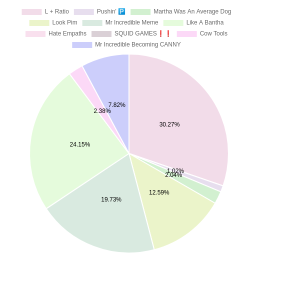

.. _usage:

Using memewizard
================
Using memewizard is very simple. This page explains all the options this program has and what they do. If you are looking for how to extend memewizard's Python toolset, look at the API Reference section for more information.

Fetching information for a single meme
--------------------------------------
When selecting this option, it will ask if you want to use KnowYourMeme or YouTube as a meme source. YouTube is data from the channel "Lessons In Meme Culture", and KnowYourMeme is the ``/memes`` endpoint from https://knowyourmemes.com. **YouTube is strongly recommended as a meme source over KnowYourMeme as memes there are more relevant.** 

When selecting YouTube, it will list all the "memes" it could find by going to Lessons In Meme Culture's channel page, scrape all the video titles from videos it can find, and run keyword extraction (which is just a regex pattern). Then it will display them to the screen in a neat way. Memes containing curse words will not be listed. (I may add an NSFW flag for people who obsess over the first amendment)

Anyways, after the list gets displayed, you select a meme by it's number to get more information about it. 

::

  ---------------
  1. This
  2. That 
  3. Foo bar
  ...
  27. Spam eggs
  ---------------

So if you see ``1. this`` in the list, you choose 1. After selecting a meme, you receive information formatted as a table that looks like this, as an example:

::

  ------  ---------------------------------------------------
  Name    This
  Status  submission
  Origin  Reddit
  Year    2021
  Type    Reaction,Song,Image Macro
  ------  ---------------------------------------------------

A side note is that a meme listed may contain extra words at the end of the meme, but selecting the meme in the list will provide the actual name.

You will then be prompted on whether you want to make Google search trend history/prediction. This is basically fetching trend history from Google Trends, and making predictions about future trend history using logistic regression.

**Why logistic regression?**

Logistic regression prediction follows patterns from existing data to create predictions. Even though Keras' LSTM was meant for prediction, that is much harder to use and also takes longer to create data. 

After that, the current data and predicted data is combined, plotted, and exported as a figure.

**Example**

.. image:: _static/figure.png

Creating a meme popularity pie chart
------------------------------------
Selecting this option will then prompt you whether you want to make a pie for current day
or multiple pies which range over the course of 30 days.

**Current day pie**

**Pies 30 days ago - now**

.. raw:: html
  :file: _static/index.html